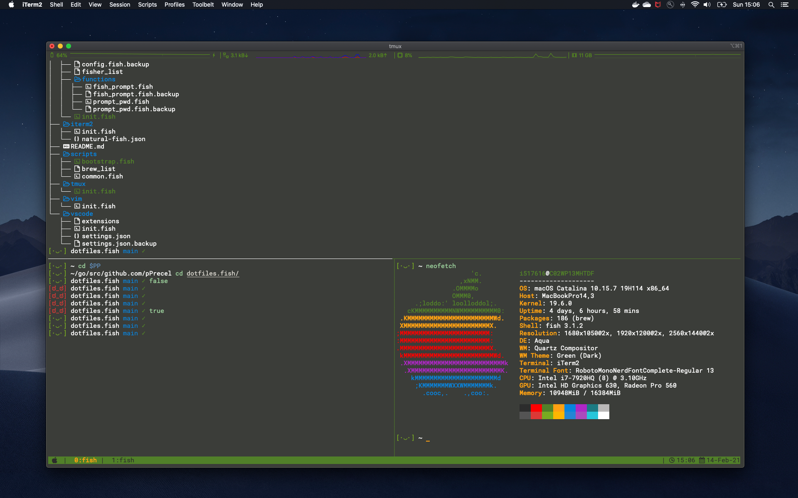
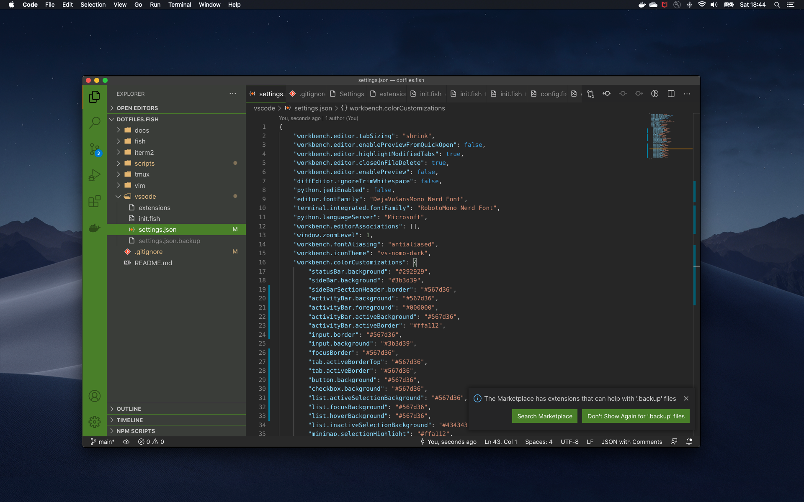

# dotfiles.fish #

[](https://github.com/pPrecel/dotfiles.fish/actions)
[](https://github.com/pPrecel/dotfiles.fish/blob/main/LICENSE)
[](http://fishshell.com)

This repo contains my dotfiles based on dotfiles made by [caarlos0](https://github.com/caarlos0/dotfiles.fish)

## Prerequisites ##

- git
- fish
- brew
- vim

## Installation ##

To install all dotfiles you have only to run `./scripts/bootstrap.fish` ( or `fish ./scripts/bootstrap.fish` ).

To upgrade dotfiles, type the `git pull origin main` and then re-install all dotfiles.

## Post-Installation ##

- [Make fish your default shell](https://fishshell.com/docs/3.0/faq.html#faq-default).
- [Switch the iTerm profile](https://apple.stackexchange.com/a/388566) to the `natural-fish` and make it default one.

## Preview ##





## Slack integration ##

Slack colors:

```text
#3B3D39,#121016,#507F29,#FBFAF7,#507F29,#FBFAF7,#507F29,#507F29,#507F29,#FBFAF7
```
